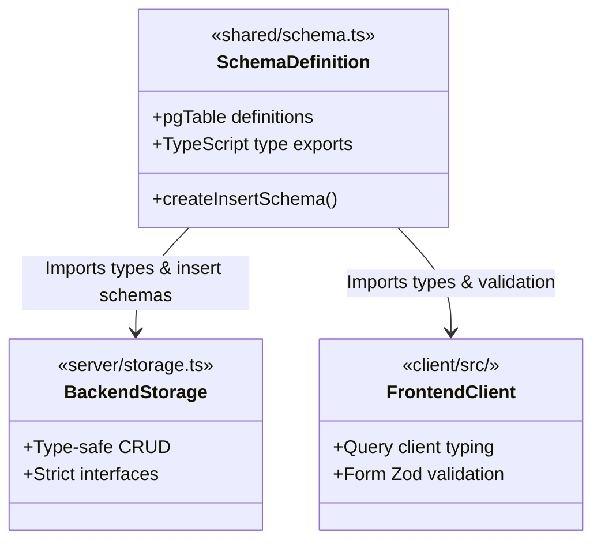

# System Architecture & Technical Design

Workit.OS is a unified workspace operating system. It features a client-server architecture with strict layer separation and a shared schema definition library for end-to-end type safety.

---

## 1. Directory Blueprint
The codebase is structured as a clear, single-repository monorepo workspace:

*   **`client/`**: React 18 SPA (Single Page Application) styled with Tailwind CSS, utilizing Radix UI accessible primitives, and managed through wouter lightweight routing. It communicates with the backend via REST API calls and an active WebSocket channel.
*   **`server/`**: Express.js server in TypeScript. Hosts REST endpoints, serves static assets (Vite dev proxy in development, static files in production), orchestrates security policies, manages authenticated client sessions, and hosts the real-time WebSocket broker.
*   **`shared/`**: Common schemas and type definitions, enabling Drizzle ORM to build database models, Zod to validate request inputs on the server, and frontend components to use exact type interfaces in React.

---

## 2. Shared Type Safety Core (`shared/schema.ts`)
The shared core acts as the single source of truth for the data model. Rather than writing database definitions, server validation schemas, and client typescript files separately:

1.  **Drizzle Pg-Core Schemas**: Standard table constructs (`users`, `tasks`, etc.) are written using pgTable definitions.
2.  **Drizzle Zod Schemas**: Auto-generated schemas are created using `createInsertSchema` (from `drizzle-zod`) to automate client input validation.
3.  **Type Extraction**: TypeScript types (e.g., `User`, `InsertUser`, `Task`) are exported directly from Drizzle tables using standard type inferences.



---

## 3. Backend Architecture Design Patterns
The server runs on Node.js using Express. It is designed to be completely modular, decoupling network routing from database access.

### A. The Storage Repository Pattern
To enforce a clean separation of concerns, the backend routes do not query the database directly. Instead:
-   **Interface Decoupling**: An interface `IStorage` defines all required data queries.
-   **Concrete Implementation**: `DrizzleStorage` implements this interface using database adapters.
-   **Central Singleton**: A singleton `storage` is exported. The routes file (`routes.ts`) calls storage functions exclusively, keeping database queries out of API routing files.

```typescript
// server/storage.ts
export interface IStorage {
  getUser(id: string): Promise<User | undefined>;
  createUser(user: InsertUser): Promise<User>;
  // ...
}
export class DrizzleStorage implements IStorage {
  async getUser(id: string) { ... }
}
export const storage = new DrizzleStorage();
```

### B. Double-Gated Access Control (RBAC)
User actions are authorized at two independent check points:
1.  **Bearer Authentication Gate**: Standard JWT checks extract tokens from headers, verify signatures, and associate the session with `req.userId`.
2.  **Global Client Firewall Gate**: Intercepts requests for accounts with the `CLIENT` role, blocking all API routes unless they match the strict portal whitelists, providing bulletproof data security.

---

## 4. Frontend Architecture Design Patterns

### A. Nested State Providers Hierarchy
To supply layout components, spotlight search, and forms with data, the React client boot flow utilizes a stacked tree of context providers:

```
[QueryClientProvider]         --> Orchestrates REST api queries and query caches.
  └── [ThemeProvider]          --> Manages global theme status, accent-colors, and RTL layout settings.
        └── [AuthProvider]       --> Decodes JWT tokens, preserves user profile details, manages sign-ins.
              └── [TooltipProvider]  --> Delivers accessible tooltips.
                    └── [SidebarUIProvider] --> Controls layout collapse states.
                          └── [ShortcutsProvider] --> Controls global hotkey bindings.
                                └── [QuickCreateProvider] --> Handlers for quick creation drawers.
                                      └── [DetailPanelProvider] --> Manages side-sheets for detail editing.
                                            └── [CommandPaletteProvider] --> Active CMD+K Spotlight search.
```

### B. Declarative Server State with TanStack Query
We avoid maintaining massive manual arrays of tasks, comments, and files in standard React components.
-   **Query Caches**: All server requests are managed by React Query. Queries are indexed by keys (e.g., `["/api/tasks", projectId]`).
-   **Cache Invalidation**: Mutations (e.g., adding a task comment or updating a stage) trigger key invalidations, prompting background refetches across open dashboards.
-   **Optimistic Cache Updates**: When a page title is updated, the system updates the local client cache instantly, allowing the UI to react without waiting for network responses.

### C. Glassmorphism Design Token Core (`index.css`)
Custom Tailwind configurations define modern visual design features:
-   **Translucent surfaces**: Backdrop filters (`backdrop-blur-md bg-white/40 border-white/20`) allow background gradients to show through, creating high-end, premium layers.
-   **Custom Accent-Colors**: Standard classes represent active theme colors (`indigo`, `emerald`, `violet`) mapped directly to client selections in settings.
