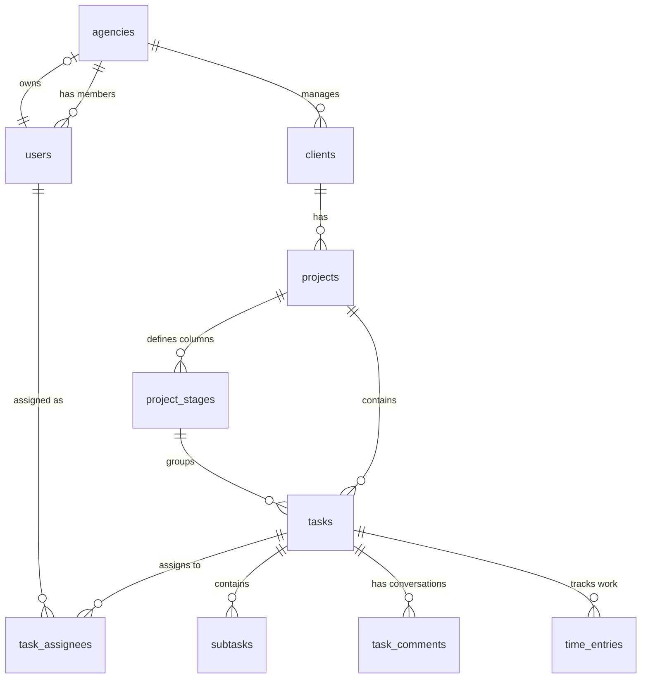

# Database Schema & Relational Blueprint

The Workit.OS database layer is defined in `shared/schema.ts` and managed through **Drizzle ORM** with PostgreSQL. It leverages relational constraints, unique indexes, arrays, and JSONB columns to power task pipelines, Notion-style block editors, attendance metrics, and audit logs.

---

## 1. Core Data Model Overview

---

## 2. Key Database Enums

*   **`role`**: Defines user authorization scopes.
    `["OWNER", "ADMIN", "TEAM_LEADER", "SUPERVISOR", "EMPLOYEE", "HR", "PROJECT_MANAGER", "TEAM_MEMBER", "CLIENT"]`
*   **`user_status`**: User system access state. `["ACTIVE", "INVITED", "DEACTIVATED"]`
*   **`client_status`**: Pipeline condition. `["ACTIVE", "PAUSED", "AT_RISK", "CHURNED", "INACTIVE", "ARCHIVED"]`
*   **`project_status`**: Project lifecycle. `["PLANNING", "ACTIVE", "ON_HOLD", "COMPLETED", "CANCELLED", "ARCHIVED"]`
*   **`task_priority`**: Importance tag. `["LOW", "MEDIUM", "HIGH", "URGENT"]`
*   **`task_review_status`**: PM/Client approval flow. `["NOT_REQUIRED", "PENDING", "APPROVED", "CHANGES_REQUESTED", "PM_OVERRIDE"]`
*   **`block_type`**: Rich Notion editor blocks. `["PARAGRAPH", "HEADING1", "HEADING2", "TOGGLE", "CALLOUT", "CODE", "IMAGE", "DIVIDER", "BULLET_LIST", "NUMBERED_LIST"]`
*   **`fault_attribution`**: Quality audit tags. `["AGENCY_ERROR", "CLIENT_CHANGED_MIND", "BRIEF_UNCLEAR", "TECHNICAL_ISSUE"]`

---

## 3. Core Operational Tables

### A. Tenant Workspace Configuration

#### `agencies`
The fundamental tenant container for the platform.
-   `id`: `text` (UUID primary key)
-   `name`: `text` (Agency name)
-   `slug`: `text` (Unique sub-domain/workspace locator)
-   `logo`: `text` (Asset URL)
-   `timezone` / `currency` / `locale`: Localized display specifications.
-   `plan`: `agency_plan` (Subscription billing level: `FREE`, `PRO`, `ENTERPRISE`)
-   `workingDays`: `integer[]` (Arrays indicating business days, e.g., `[0, 1, 2, 3, 4]`)
-   `ownerId`: `text` (Foreign key pointing to `users.id`)

#### `users`
Profiles for colleagues and client access users.
-   `id`: `text` (Primary Key matching Auth profile)
-   `name` / `email`: Primary contacts.
-   `passwordHash`: `text` (Bcrypt secured passwords)
-   `status`: `user_status` (Tracks deactivations: `ACTIVE`, `INVITED`, `DEACTIVATED`)
-   `role`: `role` (Workspace roles, e.g., `ADMIN`, `TEAM_MEMBER`)
-   `agencyId`: `text` (Foreign key linking user to their tenant workspace `agencies.id`)
-   `clientId`: `text` (Optional link to `clients.id` for external client users)

---

### B. Client Management & Strategy

#### `clients`
Contains target profiles managed by the agency.
-   `id`: `text` (Primary Key)
-   `name` / `website` / `logo` / `coverImage` / `notes`: Brand assets.
-   `healthScore`: `integer` (Calculated metrics reflecting client satisfaction/approvals)
-   `portalEnabled`: `boolean` (Enables/disables client login access)
-   `monthlyBudget` / `hourlyRate`: Financial thresholds.
-   `agencyId`: `text` (Foreign key mapping to the tenant `agencies.id`)

#### `brand_kits`
Stores design identities for client accounts.
-   `clientId`: `text` (Unique foreign key to `clients.id`, ensuring a 1:1 mapping)
-   `primaryColor` / `secondaryColor` / `accentColor`: Hex color keys.
-   `additionalColors`: `jsonb` (Custom secondary palettes)
-   `primaryFont` / `secondaryFont`: Preferred typography.
-   `toneOfVoice` / `targetAudience`: Brand directives.
-   `dos` / `donts`: `jsonb` lists of guidelines.

---

### C. Kanban & Project Operations

#### `projects`
Tracks structured pipeline categories containing task boards.
-   `id`: `text` (Primary Key)
-   `name` / `description`: Project descriptions.
-   `status`: `project_status` (Planning, Active, Completed, etc.)
-   `agencyId`: `text` (Foreign key to `agencies.id`)
-   `clientId`: `text` (Foreign key to `clients.id` linking the board to the account)

#### `project_stages`
Defines columns in Kanban boards (e.g., "To Do", "In Progress", "In Review").
-   `id`: `text` (Primary Key)
-   `name`: `text` (Column title)
-   `color`: `text` (Hex code for visual labels)
-   `order`: `integer` (Column placement order, e.g., `1`, `2`, `3`)
-   `wipLimit`: `integer` (Work-In-Progress cap limits)
-   `isClientReview`: `boolean` (If `true`, pushing tasks here exposes them to the Client Portal)
-   `projectId`: `text` (Foreign key to `projects.id`)

#### `tasks`
The central ticket entity.
-   `id`: `text` (Primary Key)
-   `title` / `description`: Task descriptions.
-   `type`: `task_type` (Design, Copy, Development, Strategy, etc.)
-   `priority`: `task_priority` (Low, Medium, High, Urgent)
-   `reviewStatus`: `task_review_status` (Approval pipelines)
-   `estimatedMinutes` / `actualMinutes`: Time constraints.
-   `position`: `integer` (Board vertical placement ordering)
-   `projectId`: `text` (Foreign key linking task to parent board `projects.id`)
-   `stageId`: `text` (Foreign key mapping task to Kanban column `project_stages.id`)
-   `createdById`: `text` (Foreign key identifying creator `users.id`)

---

### D. Notation & Notion block engines

#### `pages`
The parent document metadata record.
-   `id`: `text` (Primary Key)
-   `title`: `text` (Document title)
-   `content`: `jsonb` (Full block array state. Houses type tags, text values, checkboxes, and styling keys)
-   `isFolder`: `boolean` (Indicates directory levels)
-   `parentId`: `text` (Self-referential key mapping page to a parent page, supporting nested folder trees)
-   `agencyId`: `text` (Foreign key scoped to tenant `agencies.id`)

#### `blocks`
Optional transactional record mapping blocks to individual items (tasks, projects) for robust documentation layouts.
-   `id`: `text` (Primary Key)
-   `type`: `block_type` (e.g., callout, heading, todo)
-   `content`: `jsonb` (Block specific variables)
-   `position`: `integer` (Vertical ordering index)
-   `parentId`: `text` (Self-referential nesting)
-   `taskId` / `projectId` / `clientId`: Multi-purpose foreign keys.
