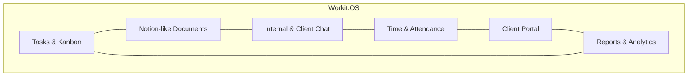

# Product Context: Workit.OS

## Product Vision
**Workit.OS** is a comprehensive team management, collaboration, and productivity workspace designed specifically for marketing agencies, creative studios, and project-based organizations. 

Creative agencies typically suffer from **tool fatigue**—the friction of switching between separate platforms for task management (e.g., Asana/Jira), client feedback (e.g., email/shared sheets), internal communication (e.g., Slack/Teams), time tracking (e.g., Harvest/Toggl), document collaboration (e.g., Notion/Google Docs), and file delivery (e.g., WeTransfer/Drive). 

Workit.OS solves this by consolidating all core agency workflows into a single unified "Operating System."

---

## Core Value Pillars

### 1. Unified Workspace (All-in-One OS)
By integrating tasks, docs, chat, time, and client feedback into a single, high-fidelity application, Workit.OS eliminates context-switching penalties. Teams work in a coherent interface where a task can house rich documents, link to timesheets, contain file assets, and support live conversations.

### 2. Radical Transparency & Frictionless Client Portals
Most agencies operate in silos and manually compile progress updates for clients. Workit.OS features a **native Client Portal** with security-hardened boundaries. Clients can log in to view project progression, download explicitly shared assets, chat in dedicated client-agency channels, and approve or request changes on tasks—eliminating email chains and accelerating deliverables.

### 3. High-Fidelity & Modern Aesthetic (Glassmorphism)
Unlike generic enterprise dashboards, Workit.OS features a cutting-edge **Glassmorphism design system**. Translucent panels, curated HSL gradient backdrops, sleek dark/light mode toggles, micro-animations, and customizable accent colors make using the platform a premium, engaging experience.

### 4. Flexible Document Collaboration
Instead of static markdown or rich text boxes, the platform integrates a **Notion-like nested block editor**. Teams can create rich structured documents with dynamic elements (like interactive check-lists, toggle blocks, highlighted callouts, and code snippets) directly inside pages or tasks.

---

## Target Audience & Personas

| Role | Core Needs | Workspace Feature Focus |
| :--- | :--- | :--- |
| **Owner / Agency Director** | Agency health overview, revenue/hour audits, client satisfaction, and subscription management. | Reports & Analytics, Client Health Score, Settings. |
| **Project Manager (PM)** | Resource allocation, pipeline management, scope verification, and client sign-offs. | Kanban Boards, Task Dependencies, Review Outcomes. |
| **Creative / Team Member** | Clear work pipelines, task requirements, seamless document editors, and time logs. | Task Kanban, Block Editor (Pages), Chat, Attendance. |
| **Client** | High-level delivery timelines, direct feedback channels, and easy asset approvals. | Client Portal, Client-Agency Channel, File downloads. |

---

## Key User Flows

### A. The Client Intake & Project Planning Flow
1. **PM** creates a new **Client** profile in the workspace (optionally creating a custom **Brand Kit** and strategic milestones).
2. **PM** creates a **Project** for the client and initializes it with standard boards (To Do, In Progress, Review, Done).
3. **PM** invites **Agency Members** to the project and assigns them to collaborative tasks.

### B. The Creative Delivery & Client Review Loop
1. **Creative** logs in, clocks in via **Attendance**, and navigates to the **Kanban Board** to see their tasks.
2. The Creative works on a design, documents details in the task's **Block Editor**, and uploads file assets.
3. Once completed, the Creative marks the task's review status as `PENDING` and assigns it to a **Supervisor**.
4. If approved internally, the task is promoted to **Client Review**.
5. The **Client** accesses their secure **Client Portal**, views the task, views files, leaves feedback, and marks it as **APPROVED** or **CHANGES_REQUESTED**.
6. The event is captured in **Quality Events** and logs toward the **Quality Snapshot** metrics.

### C. The Daily Productivity Flow
1. **Teammate** logs in, clicks "Check-In" on the Attendance dashboard, and logs manual or timer-based **Time Entries** against active projects.
2. The Teammate uses the global **Command Palette** (`Ctrl+K` or `/`) to quickly jump between active channels, edit pages, find tasks, or switch themes.
3. Real-time updates (new comments, chat messages, task assignments) flow seamlessly over **WebSockets** and deliver live in-app notifications.
