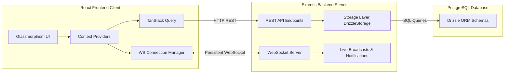

# System Patterns: Workit.OS

## Overall System Architecture
Workit.OS is built as a single-repository monorepo structure containing a React frontend client, an Express backend server, and a shared TypeScript package for schemas and validation.

---

## Backend Architecture Patterns (Express + Drizzle)

### 1. Unified Interface Storage Layer (`IStorage`)
To separate database concerns from HTTP route handling, the backend utilizes the **Repository Pattern**. 
- `server/storage.ts` defines a strict `IStorage` TypeScript interface specifying all data access methods (CRUD operations, aggregates, queries).
- `DrizzleStorage` implements `IStorage`, performing type-safe queries on Neon PostgreSQL using Drizzle ORM.
- Allows for easy testing, mocking, or swapping of the storage adapter (e.g., adding an in-memory test database or Redis caching layers).

### 2. Multi-Tenant Scoping & Strict Tenant Separation
Workit.OS is a multi-tenant SaaS application. It is paramount that data from one agency is never exposed to another agency.
- **Tenant Scoping**: All operational tables (`tasks`, `projects`, `clients`, `invitations`, `time_entries`, etc.) contain an `agency_id` column.
- **Verification Helpers**: Core routes utilize server-side scoping checks. For example, `verifyTaskAgency(taskId, userId)` fetches both entities and ensures their `agencyId` fields match before proceeding with mutations or comment creation.
- **Admin Guards**: Helpers like `requireAgencyAdmin` query the user role (`OWNER` or `ADMIN`) and match their `agencyId` with the route parameter before permitting administrative changes.

### 3. Hardened Role-Based Access Control (RBAC) & Client Protection
The system supports distinct user roles: `OWNER`, `ADMIN`, `TEAM_LEADER`, `SUPERVISOR`, `EMPLOYEE`, `HR`, `PROJECT_MANAGER`, `TEAM_MEMBER`, and `CLIENT`.
- **Global Client Guard Middleware**: To prevent client-role users from accessing internal data via REST API endpoints, a global Express middleware is registered. 
- It intercepts all requests starting with `/api/` and checks if the authenticated user has the `CLIENT` role.
- If so, it blocks access and returns `403 Forbidden` unless the requested path matches an explicitly allowed whitelist:
  - `/api/auth/` (Login, Register, and Me details)
  - `/api/client-portal/` (Secure Client Portal projects, tasks, files, and chat channels)
  - `/api/invitations/by-token/` (Public token checking during onboarding)
  - `/api/chat/channels` (Portal channel only)

### 4. WebSocket Notification & Broadcast Protocol
Real-time operations are powered by a native WebSocket server integrated onto the HTTP listener:
- **Connection Authentication**: Sockets connect to `/ws?token=<JWT>`. The server parses the token, verifies the JWT, and maps the connection's socket to the associated `userId` inside a `userSockets` mapping (supporting multiple tabs/devices per user).
- **In-App Live Push**: The backend `notifyUser` utility writes a permanent record to the `notifications` table and instantly broadcasts the payload over any active sockets registered to that user.
- **Chat Broadcast**: Messages posted in channels are broadcast to all connected WebSocket clients on the server, prompting real-time UI updates.

---

## Frontend Architecture Patterns (React 18 + TanStack Query)

### 1. Nested Context Hierarchy
The client boot flow wraps the Router inside a robust tree of state contexts, ensuring UI states, keyboards, drawers, themes, and authentication are accessible globally:
1. `QueryClientProvider` (TanStack Query client)
2. `ThemeProvider` (Accent colors, light/dark modes)
3. `AuthProvider` (Main auth tokens, profile refreshes)
4. `TooltipProvider` (Shadcn tooltips)
5. `SidebarUIProvider` (Sidebar open/collapsed state)
6. `ShortcutsProvider` (Global keyboard shortcuts)
7. `QuickCreateProvider` (Modal launchers for tasks/projects)
8. `DetailPanelProvider` (Slide-over detail pane controllers)
9. `CommandPaletteProvider` (CMD+K spotlight engine)

### 2. State & Cache Separation
- **Local UI State**: Handled via standard React `useState` and specialized Context providers (e.g., sidebar collapse, detail panel open).
- **Server State**: Managed exclusively through **TanStack Query (React Query)**. Avoids manual local caching and handles loading, error, polling, and mutations.
- **Optimistic Updates**: Page editors and title changes perform optimistic updates on the React Query cache, rendering titles instantly before the server returns the confirmation.

### 3. Glassmorphic Design System
The visual language is defined by the Glassmorphism trend. The application imports utility wrappers like `GlassCard` and uses standard Tailwind classes combined with custom styling to create:
- Backdrop filters (`backdrop-blur-md`)
- Semi-translucent border styles (`border-white/10`, `border-black/5`)
- Radial gradients for backdrops and interactive elements
- Dynamic accent colors mapped to standard HSL palettes (Indigo, Emerald, Violet, etc.) configured in `contexts/ThemeContext.tsx`.

### 4. Notion-Like Block Document System
Rather than textareas or standard WYSIWYG boxes, documents in Pages are composed of **Blocks**.
- **Data Model**: Stored in a PostgreSQL `JSONB` array containing objects of `{ id: string, type: string, content: string }`.
- **Block Conversion**: Users can easily change a block's type (e.g., converting text to heading 1 or heading 2). The data model handles it as a change in the `type` tag while keeping the content.
- **Dynamic Renderers**: Specialized UI elements render bullets, numbers, to-do lists with active checkboxes, syntactically-colored code boxes, and colored callout grids with customizable icons.
- **Debounced Auto-Save**: Both page titles and block updates trigger a debounced saving mechanism that automatically pushes mutations to the backend after 1000ms of typing inactivity.
