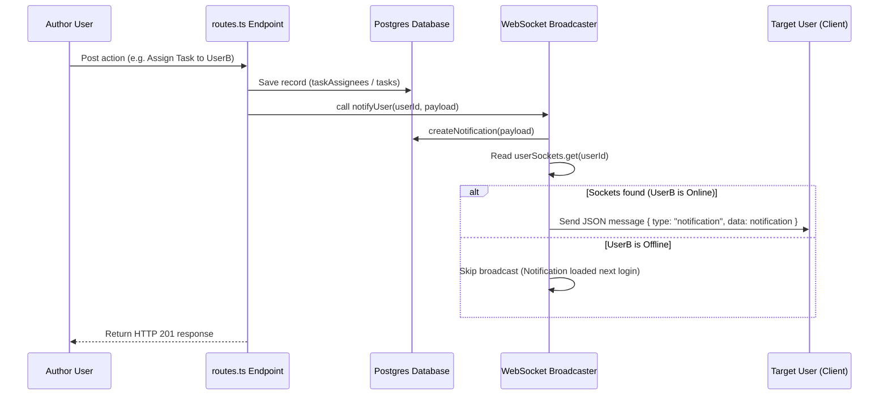

# WebSocket Protocol & Real-Time Communication

Workit.OS is a highly collaborative workspace. Real-time updates—such as instant in-app alerts, dynamic chat logs, and workspace task shifts—are coordinated via an Express-mounted **WebSocket Server (`ws`)**.

---

## 1. Connection Architecture

The WebSocket listener is attached to the main HTTP server on the `/ws` path.

```
[Client React SPA] --- Persistent WS --- [/ws?token=<JWT>] ---> [Server ws Broker]
```

### A. Handshake & Authenticated Upgrade
To establish a connection, the client initiates an upgrade request appending the JWT token as a query parameter:
```typescript
const socket = new WebSocket(`ws://localhost:5000/ws?token=${userToken}`);
```

1.  **Token Extraction**: Upon a `connection` event, the server extracts `?token=<JWT>` from the upgrade URL.
2.  **Signature Verification**: The token is decoded using `jwt.verify` against `JWT_SECRET`.
3.  **Active Connections Registry**:
    -   If valid, the connection is associated with the `userId`.
    -   Because users can have multiple browser tabs or devices open simultaneously, active connections are mapped in the server using a **Set** collection inside `userSockets`:
        ```typescript
        const userSockets = new Map<string, Set<WebSocket>>();
        ```
    -   If token verification fails or no token is provided, the socket remains active as an **anonymous connection** (unable to receive scoped notifications, but still capable of basic anonymous message broadcasts).

### B. Graceful Connection Tear-Down
When the socket closes (`close` event) or encounters an error, the connection is removed from the Set:
-   If the user closes all open tabs (the Set becomes empty), the user key is deleted from `userSockets` to free memory.

---

## 2. In-App Real-Time Notifications Flow

Transactional workspace changes (like assignment shifts, task completions, and reviewer requests) utilize the server-side `notifyUser` broadcast engine:



### Server Implementation
The server aggregates database writes and WebSocket pushes in a single, resilient function. If a database insert fails or a WebSocket connection closes mid-send, the error is swallowed so that the originating user action does not fail:

```typescript
async function notifyUser(
  userId: string,
  payload: {
    agencyId: string;
    type: typeof insertNotificationSchema._type.type;
    title: string;
    body?: string;
    actorUserId?: string;
    entityType?: string;
    entityId?: string;
    deepLink?: string;
  }
): Promise<void> {
  try {
    // 1. Write the permanent record to database
    const notification = await storage.createNotification({
      userId,
      agencyId: payload.agencyId,
      type: payload.type,
      title: payload.title,
      body: payload.body,
      actorUserId: payload.actorUserId,
      entityType: payload.entityType,
      entityId: payload.entityId,
      deepLink: payload.deepLink,
    } as any);

    // 2. Broadcast live to any online socket connections for this user
    const sockets = userSockets.get(userId);
    if (sockets) {
      const message = JSON.stringify({ type: "notification", data: notification });
      sockets.forEach((s) => {
        if (s.readyState === s.OPEN) s.send(message);
      });
    }
  } catch (e) {
    console.error("[notifyUser] failed:", e);
  }
}
```

---

## 3. Real-Time Chat Messaging Protocol

Internal and Client channels run message broadcasts directly over the global socket pool:

1.  **Publish**: When a user submits a message in the chat component, the frontend fires a `POST` request to `/api/chat/channels/:channelId/messages`.
2.  **Persistence**: The message is saved to the `chat_messages` table.
3.  **Broadcast**: On successful save, the server loops through **all open client sockets** (`wss.clients`) and broadcasts the chat message payload:
    ```typescript
    wss.clients.forEach((client) => {
      if (client.readyState === WebSocket.OPEN) {
        client.send(JSON.stringify({
          type: "chat_message",
          channelId: channel.id,
          message: enrichedMessage
        }));
      }
    });
    ```
4.  **Client Reception**: The frontend Chat window listens for WebSocket messages with `type === "chat_message"` and `channelId === activeChannelId`. If matched, the message is added to the active message log.
